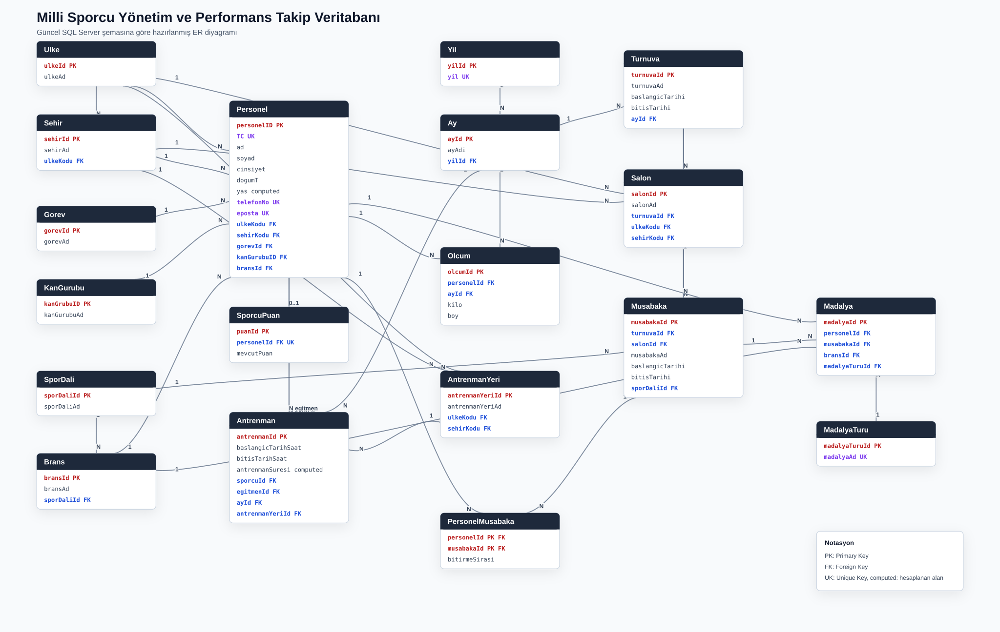

# Milli Sporcu Yönetim ve Performans Takip Veritabanı

MS SQL Server ve T-SQL ile hazırlanmış ilişkisel veritabanı projesidir. Proje; sporcu, antrenör, branş, turnuva, müsabaka, madalya, antrenman ve ölçüm kayıtlarını tutar. Ayrıca antrenman performansını raporlayan view/function, özel antrenman ekleyen stored procedure, antrenman çakışmasını engelleyen trigger ve sorgu performansı için nonclustered index içerir.

## Teknolojiler

- Microsoft SQL Server
- T-SQL
- Stored Procedure
- Trigger
- View
- Scalar Function
- Nonclustered Index

## Kurulum

SQL Server Express kullanıyorsanız proje klasöründe şu komutu çalıştırabilirsiniz:

```powershell
sqlcmd -S .\SQLEXPRESS -E -C -f 65001 -i run_all.sql
```

Not: Bu kurulum temiz bir veritabanı içindir. Aynı isimli `MilliSporcuDb` daha önce oluşturulduysa önce mevcut veritabanını yedekleyin veya farklı bir test ortamında çalıştırın.

SSMS ile çalıştıracaksanız dosyaları aşağıdaki sırayla çalıştırın:

1. `create.sql`
2. `veriler.sql`
3. `function.sql`
4. `view.sql`
5. `sp.sql`
6. `trigger.sql`
7. `index.sql`

## Veritabanı Kapsamı

- 19 tablo
- Primary key ve foreign key ilişkileri
- `UNIQUE`, `CHECK` ve computed column kullanımı
- Sporcu puanı için ayrı takip tablosu
- Antrenman süresi için hesaplanan alan
- Sporcu-ay bazlı ölçüm tekilliği
- Turnuva, müsabaka ve antrenman tarih kontrolleri

## ER Diyagramı

Güncel SQL şemasına göre hazırlanmış doğru ER diyagramı:

- [ER diyagramı](docs/assets/er-diagram.svg)
- [Diyagram kaynak dosyası](docs/er-diagram.mmd)
- [ER diyagramı ve doğruluk notları](docs/ER_DIAGRAM.md)



## Index Performans Görselleri

Şehir bazlı personel sorgusu için index öncesi/sonrası test görselleri:

- [Index öncesi](docs/assets/index-before.png)
- [Index sonrası](docs/assets/index-after.png)

## Öne Çıkan T-SQL Nesneleri

- `dbo.fn_SporcuYillikAntrenmanSuresi`: Sporcunun seçilen yıldaki toplam antrenman süresini hesaplar.
- `dbo.vw_SporcuPerformansKarnesi`: Sporcuların yıllık antrenman süresi ve performans durumunu listeler.
- `dbo.sp_OzelAntrenmanEkle`: Özel antrenman kaydı oluşturur, transaction içinde sporcu puanını artırır ve giriş doğrulaması yapar.
- `dbo.trg_AntrenmanKontrol`: Aynı sporcunun aynı gün içinde ikinci antrenman almasını engeller.
- `IX_Personel_Sehir_Sorgusu`: Şehir bazlı personel listeleme sorgusu için covering nonclustered index örneğidir.

## CV İçin Örnek Yazım

**Milli Sporcu Yönetim ve Performans Takip Veritabanı**  
MS SQL Server, T-SQL

- 19 tablodan oluşan ilişkisel veritabanı şeması tasarladım; PK/FK, `UNIQUE`, `CHECK` ve computed column kullanarak veri bütünlüğü sağladım.
- Sporcu, antrenman, turnuva, müsabaka, madalya ve ölçüm süreçleri için T-SQL tabanlı veri modeli oluşturdum.
- Stored procedure ve transaction kullanarak özel antrenman ekleme ve sporcu puanı güncelleme akışı geliştirdim.
- Trigger ile aynı sporcunun aynı gün içinde birden fazla antrenman almasını engelleyen iş kuralı uyguladım.
- View ve scalar function ile yıllık antrenman süresine göre sporcu performans raporu oluşturdum.
- Şehir bazlı personel sorgusu için nonclustered index oluşturarak sorgu performansını karşılaştırdım.

## GitHub'a Yükleme

GitHub'da boş bir repository oluşturduktan sonra proje klasöründe şu komutları çalıştırabilirsiniz:

```powershell
git init
git add .
git commit -m "Initial commit"
git branch -M main
git remote add origin https://github.com/kullanici-adi/repository-adi.git
git push -u origin main
```

`kullanici-adi` ve `repository-adi` alanlarını kendi GitHub bilgilerinize göre değiştirin.

## Geliştirilebilir Alanlar

- Örnek rapor sorgularının ayrı bir `queries.sql` dosyasında toplanması
- Test senaryolarının ayrı bir `tests.sql` dosyasına ayrılması
- `Ay` tablosuna ay numarası eklenerek tarih eşleştirmesinin daha açık hale getirilmesi
