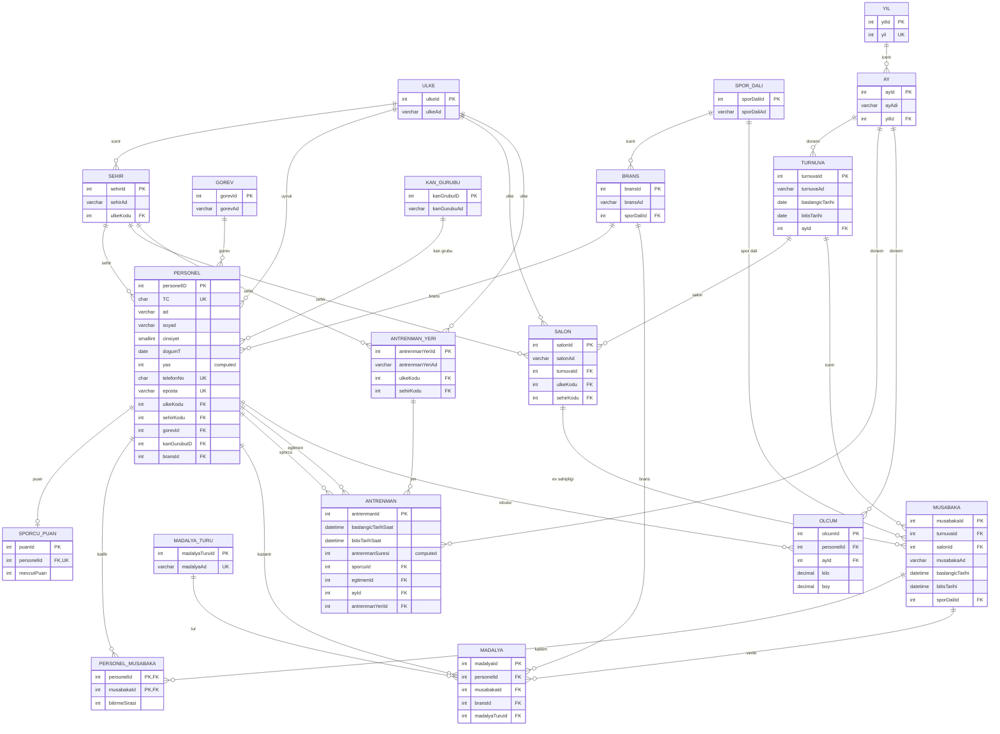

# ER Diyagramı

Bu doküman, `create.sql` dosyasındaki güncel SQL Server şemasına göre hazırlanmıştır. Yeni ve doğru ER diyagramı `docs/assets/er-diagram.svg` dosyasındadır. Düzenlenebilir Mermaid kaynak dosyası `docs/er-diagram.mmd`, SVG üretici script ise `docs/scripts/generate-er-diagram.js` altında tutulur.

## Mevcut PNG Diyagram Kontrolü

Mevcut ER diyagramı ana varlıkları doğru yakalıyor: `Personel`, `Turnuva`, `Müsabaka`, `Antrenman`, `Madalya`, `Ölçüm`, `Ülke`, `Şehir`, `Branş`, `Spor Dalı`, `Ay` ve `Yıl` var. Ancak SQL şemasına göre GitHub'da nihai diyagram olarak kullanmadan önce şu noktalar düzeltilmelidir:

- `SporcuPuan` tablosu diyagramda yok.
- `PersonelMusabaka` ara tablosu diyagramda açık bir varlık olarak görünmüyor; SQL'de personel-müsabaka ilişkisini bu tablo kuruyor.
- `Salon` tablosunun `Turnuva`, `Ülke` ve `Şehir` ile ilişkileri daha net gösterilmeli.
- `Madalya` tablosu sadece `MadalyaTuru` ile değil, `Personel`, `Müsabaka` ve `Branş` ile de ilişkili.
- `Antrenman` tablosunda `sporcuId` ve `egitmenId` aynı `Personel` tablosuna iki ayrı rol ile bağlanıyor; diyagramda bu iki rol ayrılmalı.
- `Olcum` tablosu `Personel` ve `Ay` ile ilişkilidir; diyagramda ölçümün ay bazlı tutulduğu netleşmeli.
- `Ay` tablosu `Yil` tablosuna bağlıdır; ayrıca `Turnuva`, `Antrenman` ve `Olcum` tabloları `Ay` üzerinden zaman boyutuna bağlanır.
- Bazı adlar SQL ile birebir aynı değil: `il` yerine `Sehir`, `kg/cm` yerine `kilo/boy`, `idGorev` yerine `gorevId` gibi.

## Güncel Şema

